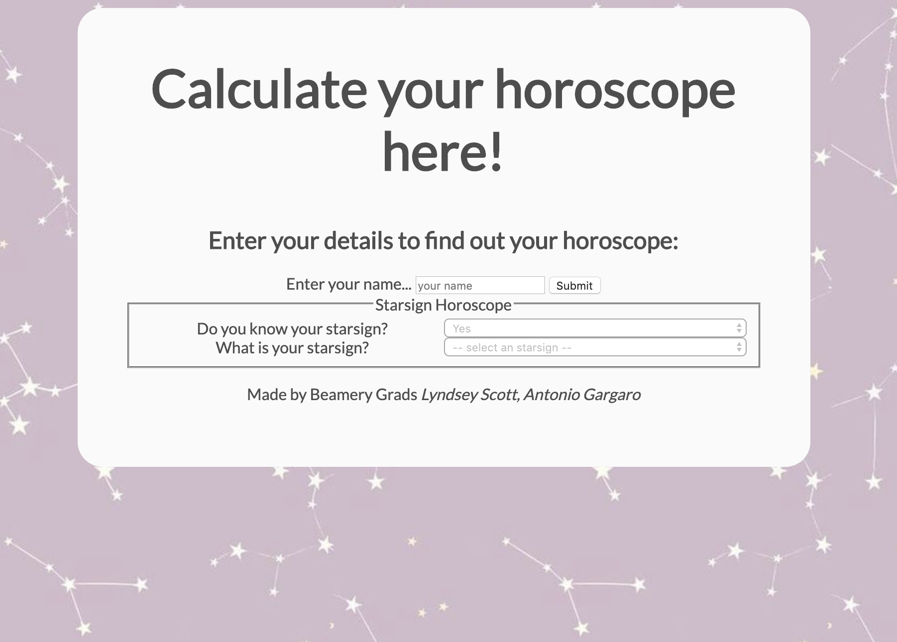
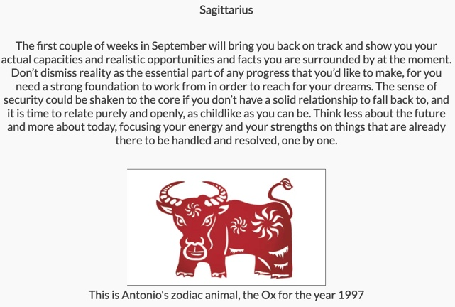
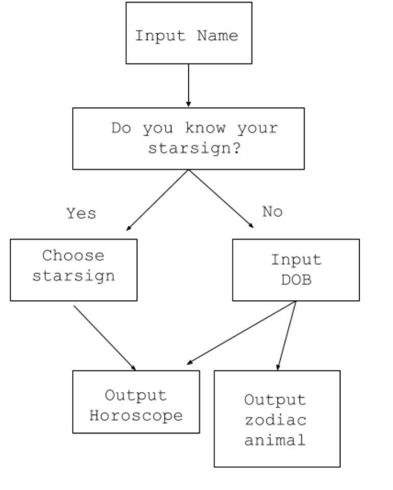

## Horoscope Generator 

## Motivation
We were tasked with making a webpage that would change display depending on the input. We also had to consider site responsiveness and semantic HTML to make sure the site was fully accessible.  This website is a horoscope generator that returns your horoscope depending on birthday and a zodiac animal depending on birth year. 
 
 
## Screenshots

## Tech/framework used
<b>Built with</b>
- [HTML](https://whatwg.org/)
- [CSS](https://www.w3.org/Style/CSS/)
- [JavaScript](https://www.ecma-international.org/publications/standards/Ecma-262.htm)

## Features
The horoscope calculator provides the user with a way to determine their starsign, corresponding horoscope and their chinese zodiac.  The form takes four inputs:
-User's name
- Do you know your starsign?
- What is your starsign OR what is your date of birth?

## User Stories
* Someone who would like to know their starsign but does not know can enter their date of birth and discover their starsign.
* Someone who would like to know their zodiac animal but does not know can enter their date of birth and discover their animal.
* Someone who would like to know their horoscope and does or does not know their starsign can discover their horoscope.

## Installation
This project can be installed by,
* Cloning this repo
* Starting a local web server
* Serve the index.html file

## Stretch Goals

Our website accessibilty audit on Chrome got an initial score of 100 but we added further semantic HTML elements to improve it. For client-side validation we added a alert if a name was less than three characters and disabled the other form elements until a name was submitted. 
In the future we want to add a visual validation when a name was submitted for the user and further improve the aesthetic of the website. 

## Credits
Developed by Lyndsey Scott (@lyndseysc) and Antonio Gargaro (@antoniogargaro) for Beamery. 
